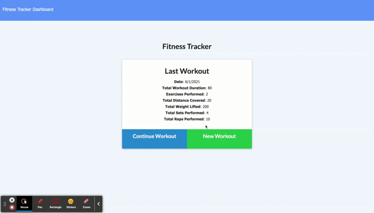

# Fitnic/ 17-fitnic

[](https://opensource.org/licenses/MIT)

- [Deployed](https://secret-reaches-96143.herokuapp.com/)
- [Repo](https://github.com/yondav/17-fitnic)

## About / Synopsis

Fitnic is a fitness tracking application for users to input their workout routines and track their progress.

Users are able to input both cardio and resistance routines to round out each workout.

Users can also track their progress via the dashboard with a visualization of their workouts via chart and graph showcasing total weight and duration of the week's workouts.

---

## Table of contents

> - [Title / Repository Name](#title--repository-name)
>   - [About / Synopsis](#about--synopsis)
>   - [Table of contents](#table-of-contents)
>   - [Installation](#installation)
>   - [Usage](#usage)
>     - [Seed](#seed)
>     - [Start Server](#start-server)
>   - [Author](#author)
>     - [Contact](#contact)
>   - [Contributing / Issues](#contributing--issues)
>     - [Contributing](#contributing)
>     - [Reporting Issues](#reporting-issues)
>   - [Technologies](#technologies)
>   - [License](#licenses)

---

## Installation

- Clone repo
- Open integrated terminal on the root directory
- Install dependencies :

```
npm i
```

---

## Usage



---

### Seed

`seeds` directory holds placeholder data to seed the database in development. Data can be changed to suit users needs or preference.

```
npm run seed
```

---

### Start Server

```
npm start
```

for `nodemon server.js`:

```
npm run watch
```

---

## Author

### Yoni David

- <a href="https://yondav.us/">Portfolio</a>
- <a href="https://github.com/yondav">Github</a>

---

### Contact

Inquiries can be sent to [info@yupny.com](mailto:info@yupny.com)

## Contributing / Issues

---

### Contributing

- Fork repo
- Make additions and changes on new, personalized branch
- Submit [pull request](https://github.com/yondav/17-fitnic/pulls)

---

### Reporting Issues

Report issues by selecting the [issues](https://github.com/yondav/17-fitnic/issues) tab and creating a new issue

---

## Technologies

- [Mongo](https://www.mongodb.com/)
- [Mongoose](https://mongoosejs.com/docs/)
- [Morgan](https://www.npmjs.com/package/morgan)
- [Semantic UI](https://semantic-ui.com/)

## Licenses

- [MIT](https://github.com/yondav/13-e-commerce-back-end/blob/main/LICENSE)

This README file was built with [README Generator](https://github.com/yondav/README-gen-09)

Copyright &copy; 2021, Yup Realty, LLC
